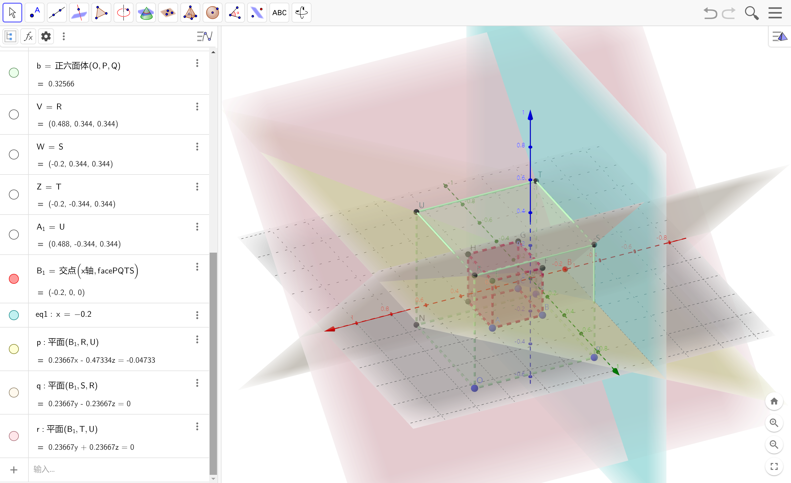

考虑兑换站兑换情况，本路径规划采用几何法建立。

# 兑换站坐标系建立

以兑换站的前表面中心为原点，向内为X轴，向左为Y轴，向上为Z轴。兑换站尺寸：288x288x288mm。

兑换站8个角点的坐标如上图。

# 兑换站外矿石安全空间

矿石尺寸：200x200x200mm。**安全距离R**取200mm (0.2m)且必须大于等于200m (0.2m)，若考虑矿石对角边则必须大于200*1.732=347mm (0.347m)。

可以得到
$$
O(0.288+R,0.144+R,-0.144-R)
$$

$$
P(0-R,0.144+R,-0.144-R)
$$

$$
Q(0-R,-0.144-R,-0.144-R)
$$

$$
N(0.288+R,-0.144-R,-0.144-R)
$$

$$
R(0.288+R,0.144+R,0.144+R)
$$

$$
S(0-R,0.144+R,0.144+R)
$$

$$
T(0-R,-0.144-R,0.144+R)
$$

$$
U(0.288+R,-0.144-R,0.144+R)
$$

$$
B_{1}(-R,0,0)
$$

## 前表面边线方程

上前表面交线ST方程：
$$
\left\{\begin{matrix}
x=-R \\
z=0.144+R
\end{matrix}\right.
$$

左前表面交线SP方程：
$$
\left\{\begin{matrix}
x=-R \\
y=0.144+R
\end{matrix}\right.
$$
右前表面交线TQ方程：
$$
\left\{\begin{matrix}
x=-R \\
y=-0.144-R
\end{matrix}\right.
$$
下前表面交线PQ方程：
$$
\left\{\begin{matrix}
x=-R \\
z=-0.144-R
\end{matrix}\right.
$$

## 决策面方程(这个三点式的平面方向咋整？)

### 前表面

$$
x+0.2\le0 \\(x+R\le0)
$$

### 上表面

$$
x+0.2>0\\(x+R>0)
$$

$$
p:0.23667x-0.47334z+0.04733\le0\\
\begin{vmatrix}
x-B_{1x}& y-B_{1y} & z-B_{1z}\\
R_{x}-B_{1x}& R_{y}-B_{1y} & R_{z}-B_{1z}\\
U_{x}- B_{1x} &U_{y}-B_{1y} &U_{z}-B_{1z}
\end{vmatrix}\le0\\
法向量向下
$$

$$
q:0.23667y-0.23667z\le0\\
\begin{vmatrix}
x-B_{1x}& y-B_{1y} & z-B_{1z}\\
R_{x}-B_{1x}& R_{y}-B_{1y} & R_{z}-B_{1z}\\
S_{x}- B_{1x} &S_{y}-B_{1y} &S_{z}-B_{1z}
\end{vmatrix}\ge0\\
法向量向上
$$

$$
r:0.23667y+0.23667z\ge0\\
\begin{vmatrix}
x-B_{1x}& y-B_{1y} & z-B_{1z}\\
T_{x}-B_{1x}& T_{y}-B_{1y} & T_{z}-B_{1z}\\
U_{x}- B_{1x} &U_{y}-B_{1y} &U_{z}-B_{1z}
\end{vmatrix}\ge0
\\法向量向上
$$

### 左表面

$$
x+0.2>0\\(x+R>0)
$$

$$
q:0.23667y-0.23667z>0\\
\begin{vmatrix}
x-B_{1x}& y-B_{1y} & z-B_{1z}\\
R_{x}-B_{1x}& R_{y}-B_{1y} & R_{z}-B_{1z}\\
S_{x}- B_{1x} &S_{y}-B_{1y} &S_{z}-B_{1z}
\end{vmatrix}<0
$$

$$
r:0.23667y+0.23667z\ge0\\
\begin{vmatrix}
x-B_{1x}& y-B_{1y} & z-B_{1z}\\
T_{x}-B_{1x}& T_{y}-B_{1y} & T_{z}-B_{1z}\\
U_{x}- B_{1x} &U_{y}-B_{1y} &U_{z}-B_{1z}
\end{vmatrix}\ge0
$$

$$
p_{1}:-0.23667x+0.47334y-0.04733\ge0\\
\begin{vmatrix}
x-B_{1x}& y-B_{1y} & z-B_{1z}\\
R_{x}-B_{1x}& R_{y}-B_{1y} & R_{z}-B_{1z}\\
O_{x}- B_{1x} &O_{y}-B_{1y} &O_{z}-B_{1z}
\end{vmatrix}\ge0
\\法向量向槽口外
$$

### 右表面

$$
x+0.2>0\\(x+R>0)
$$

$$
q:0.23667y-0.23667z\le0\\
\begin{vmatrix}
x-B_{1x}& y-B_{1y} & z-B_{1z}\\
R_{x}-B_{1x}& R_{y}-B_{1y} & R_{z}-B_{1z}\\
S_{x}- B_{1x} &S_{y}-B_{1y} &S_{z}-B_{1z}
\end{vmatrix}\ge0
$$

$$
r:0.23667y+0.23667z<0\\
\begin{vmatrix}
x-B_{1x}& y-B_{1y} & z-B_{1z}\\
T_{x}-B_{1x}& T_{y}-B_{1y} & T_{z}-B_{1z}\\
U_{x}- B_{1x} &U_{y}-B_{1y} &U_{z}-B_{1z}
\end{vmatrix}<0
$$

$$
q_{1}:0.23667x+0.47334y+0.04733\le0\\
\begin{vmatrix}
x-B_{1x}& y-B_{1y} & z-B_{1z}\\
N_{x}-B_{1x}& N_{y}-B_{1y} & N_{z}-B_{1z}\\
U_{x}- B_{1x} &U_{y}-B_{1y} &U_{z}-B_{1z}
\end{vmatrix}\ge0
\\法向量向槽口外
$$

### 下表面

$$
x+0.2>0\\(x+R>0)
$$

$$
q:0.23667y-0.23667z>0\\
\begin{vmatrix}
x-B_{1x}& y-B_{1y} & z-B_{1z}\\
R_{x}-B_{1x}& R_{y}-B_{1y} & R_{z}-B_{1z}\\
S_{x}- B_{1x} &S_{y}-B_{1y} &S_{z}-B_{1z}
\end{vmatrix}<0
$$

$$
r:0.23667y+0.23667z<0\\
\begin{vmatrix}
x-B_{1x}& y-B_{1y} & z-B_{1z}\\
T_{x}-B_{1x}& T_{y}-B_{1y} & T_{z}-B_{1z}\\
U_{x}- B_{1x} &U_{y}-B_{1y} &U_{z}-B_{1z}
\end{vmatrix}<0
$$

$$
r_{1}:0.23667x+0.47334z+0.04733\le0\\
\begin{vmatrix}
x-B_{1x}& y-B_{1y} & z-B_{1z}\\
O_{x}-B_{1x}& O_{y}-B_{1y} & O_{z}-B_{1z}\\
N_{x}- B_{1x} &N_{y}-B_{1y} &N_{z}-B_{1z}
\end{vmatrix}\ge0
\\法向量向下
$$

# 将相机坐标系目标转换为机器人坐标系目标

车身机器人坐标W

车身相机坐标C

目标机器人坐标G

目标相机坐标A
$$
_{C}^{W} T=\begin{bmatrix}
 0& 0& 1& 0\\
-1& 0& 0& 0\\
 0&-1& 0& 0\\
 0& 0& 0& 1
\end{bmatrix}
$$

$$
_{A}^{C} T=\begin{bmatrix}
r_{11}&r_{12}&r_{13}&p_{x}\\
r_{21}&r_{22}&r_{23}&p_{y}\\
r_{31}&r_{32}&r_{33}&p_{z}\\
     0&     0&     0& 1
\end{bmatrix}
$$

$$
_{G}^{A} T=\begin{bmatrix}
 0&-1& 0& 0\\
 0& 0&-1& 0\\
 1& 0& 0& 0\\
 0& 0& 0& 1
\end{bmatrix}
$$

从而
$$
_{G}^{W} T={_{C}^{W}T} \space {_{A}^{C}T} \space {_{G}^{A}T} =\begin{bmatrix}
 r_{33}&-r_{31}&-r_{32}& p_{z}\\
-r_{13}& r_{11}& r_{12}&-p_{x}\\
-r_{23}& r_{21}& r_{22}&-p_{y}\\
 0& 0& 0& 1
\end{bmatrix}
$$
从而
$$
_{W}^{G} T=\begin{bmatrix}
 r_{33}&-r_{13}&-r_{23}& p_{y}r_{13} - p_{x}r_{33} + p_{z}r_{23}\\
-r_{31}& r_{11}& r_{21}& p_{x}r_{31} - p_{y}r_{11} - p_{z}r_{21}\\
-r_{32}& r_{12}& r_{22}& p_{x}r_{32} - p_{y}r_{12} - p_{z}r_{22}\\
 0& 0& 0& 1
\end{bmatrix}
$$

# 计算吸盘点路径的中间点（安全空间前表面边缘）

已知吸盘平面点在G下的坐标**（位于上下左右决策面）**
$$
^{G}P_{s}=({^{G}P_{sx}},{^{G}P_{sy}},{^{G}P_{sz}})
$$
则由
$$
^{G}P_{s} \space、B_{1}\space、原点
$$
三个点组成的平面的方程为：
$$
\begin{vmatrix}
x-B_{1x}& y-B_{1y} & z-B_{1z}\\
Ori_{x}-B_{1x}& Ori_{y}-B_{1y} & Ori_{z}-B_{1z}\\
^{G}P_{sx}- B_{1x} &^{G}P_{sy}-B_{1y} &^{G}P_{sz}-B_{1z}
\end{vmatrix}=0
$$
即
$$
\begin{vmatrix}
x+R& y & z\\
R& 0 & 0\\
^{G}P_{sx}+R &^{G}P_{sy} &^{G}P_{sz}
\end{vmatrix}=0
$$
即
$$
-{^{G}P_{sz}}\cdot y+{^{G}P_{sy}}\cdot z=0
$$

### 该平面与安全空间上前表面交线的交点

$$
(-R,\frac{{^{G}P_{sy}}\cdot (0.144+R)}{^{G}P_{sz}},0.144+R)\\显然^{G}P_{sz}不可能为0
$$

### 该平面与安全空间左前表面交线的交点

$$
(-R,0.144+R,\frac{{^{G}P_{sz}}\cdot (0.144+R)}{^{G}P_{sy}})\\显然^{G}P_{sy}不可能为0
$$

### 该平面与安全空间右前表面交线的交点

$$
(-R,-0.144-R,\frac{{^{G}P_{sz}}\cdot (-0.144-R)}{^{G}P_{sy}})\\显然^{G}P_{sy}不可能为0
$$

### 该平面与安全空间下前表面交线的交点

$$
(-R,\frac{{^{G}P_{sy}}\cdot (-0.144-R)}{^{G}P_{sz}},-0.144-R)\\显然^{G}P_{sz}不可能为0
$$

## 如果离兑换站比较近

直接后退到前表面上

若$|{^{G}P_{sy}}|\le0.144+R$  且 $|{^{G}P_{sz}|\le0.144+R}$：

则有中间点为：
$$
(-R,{^{G}P_{sy}},{^{G}P_{sz}})
$$

